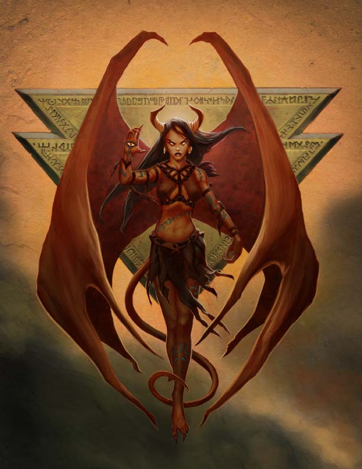

## The Diabolist
Source:: [Pelgrane Press - The Diabolist](https://pelgranepress.com/2012/06/05/behind-the-illustration-the-diabolist/)

The **Diabolist** controls fiends and tampers with forces even the Archmage avoids. She likes her victims screaming and her chaos pure while claiming that the demons she summons would otherwise overwhelm the Great Gold Wyrm who seals the Abyss. There are two differences between her and her demons: First, she likes keeping destruction personal rather than universal. Second, she’s capable of kindness, so long as it comes as a great surprise.