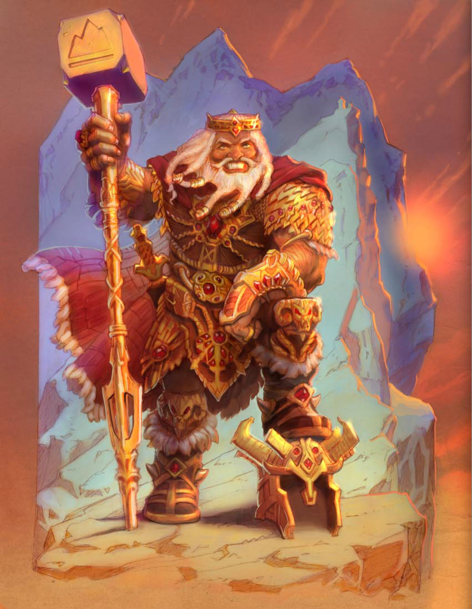

## The Dwarf King

**Source**:: [Pelgrane Press](https://pelgranepress.com/2012/05/16/behind-the-illustration-the-dwarf-king-of-13th-age/)

 The **Dwarf King** is lord of Forge, the dwarves’ new homeland beneath the mountains. He’d love to reclaim the dwarven Underhome lost to war against the dark elves and the creatures of the deeps. But now that the Empire is stumbling, the dwarves find themselves manning the mountain walls that shield the Empire from the orcs and monsters of the north.