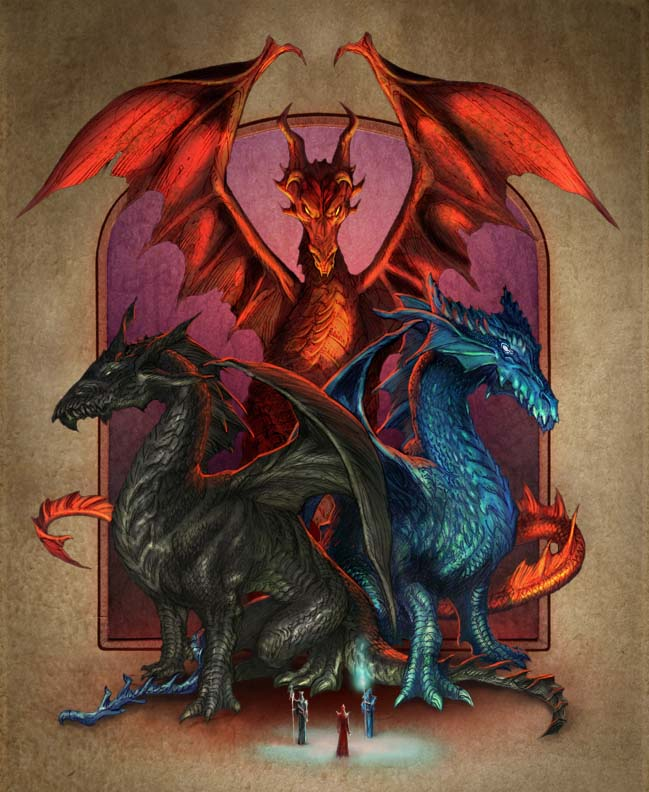

## The Three
**Source**:: [Pelgrane Press - The Three](https://pelgranepress.com/2012/06/13/behind-the-illustration-the-three/)

The Three were among the first dragons to walk the world. The Red is a living engine of destruction. The Blue is a sorceress, perhaps even the original mother of all sorcery. The Black is queen of shadows and assassins. Unlike the Great Gold Wyrm, who must fight alone, the Three have learned to join forces.