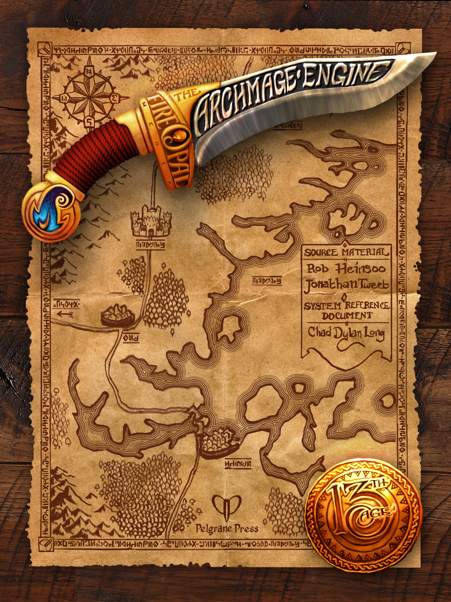

## 13th Age System Reference Document

### Table of Contents

1. [13th Age SRD Map of Contents](../..//13thAgeShare/Map-of-Contents.md)
2. [13th Age Legal Notice](LICENSE.md)
	1. [Product Identity](LICENSE.md#Product%20Identity)
	2. [Open Content](LICENSE.md#Open%20Content)
	3. [Open Game License](LICENSE.md#Open%20Game%20License)
	4. [*13th Age* Archmage Engine](LICENSE.md#*13th%20Age*%20Archmage%20Engine)
3. [Icons](Icons/Icons.md) 
4. [Character Rules](Character-Rules/Character-Rules.md)
	1. [Race](Character-Rules/Race.md)
	2. [Class](Character-Rules/Class.md)
	3. [Abilities](Character-Rules/Abilities.md)
	4. [Combat Stats](Character-Rules/Combat-Stats.md)
	5. [One Unique Thing](Character-Rules/One-Unique-Thing.md)
	6. [Icon Relationships](Character-Rules/Icon-Relationships.md)
	7. [Backgrounds and Skill Checks](Character-Rules/Backgrounds-and-Skill-Checks.md)
	8. [Feats](Character-Rules/Feats/Feats.md)
	9. [Gear](Character-Rules/Gear/Gear.md)
5. [Races](Races/Races.md)
	1. [Human](Races/Human.md)
	2. [Dwarf](Races/Dwarf.md)
	3. [Dark Elf](Races/Dark-Elf.md)
	4. [High Elf](Races/High-Elf.md)
	5. [Wood Elf](Races/Wood-Elf.md)
	6. [Gnome](Races/Gnome.md)
	7. [Half Elf](Races/Half-Elf.md)
	8. [Halfling](Races/Halfling.md)
	9. [Half-Orc](Races/Half-Orc.md)
	10. [Dragonic](Races/Dragonic-Dragonspawn.md)/[Dragonspawn](Races/Dragonic-Dragonspawn.md)
	11. [Holy One](Races/Holy%20One-Aasimar.md)/[Aasimar](Races/Holy%20One-Aasimar.md)
	12. [Forgeborn](Races/Forgeborn-Dwarf-forged.md)/[Dwarf-forged](Races/Forgeborn-Dwarf-forged.md)
	13. [Tiefling](Races/Tiefling-Demontouched.md)/[Demontouched](Races/Tiefling-Demontouched.md)
6. [Classes](Classes/Classes.md)
	1. [Class-Basics](Classes/Class-Basics.md)
	2. [Barbarian](Classes/Barbarian.md)
	3. [Bard](Classes/Bard.md)
	4. [[Chaos Mage]]
	5. [[Cleric]]
	6. [[Commander]]
	7. [[Druid]]
	8. [[Fighter]]
	9. [[Monk]]
	10. [[Necromancer]]
	11. [[Occultist]]
	12. [[Paladin]]
	13. [[Ranger]]
	14. [[Rogue]]
	15. [[Sorcerer]]
	16. [[Wizard]]
7. [Multiclassing](Multiclassing/Multiclassing.md)
	1. [Multiclassing Basics](Multiclassing/Multiclassing.md#Multiclassing%20Basics)
	2. [Key Ability Modifier](Multiclassing/Multiclassing.md#Key%20Ability%20Modifier)
	3. [Barbarian Multiclass](Multiclassing/Barbarian-Multiclass.md)
	4. [Bard Multiclass](Multiclassing/Bard-Multiclass.md)
	5. [Chaos Mage Multiclass](Multiclassing/Chaos-Mage-Multiclass.md)
	6. [Cleric Multiclass](Multiclassing/Cleric-Multiclass.md)
	7. [Commander Multiclass](Multiclassing/Commander-Multiclass.md)
	8. [Druid Multiclass](Multiclassing/Druid-Multiclass.md)
	9. [Fighter Multiclass](Multiclassing/Fighter-Multiclass.md)
	10. [Monk Multiclass](Multiclassing/Monk-Multiclass.md)
	11. [Necromancer Multiclass](Multiclassing/Necromancer-Multiclass.md)
	12. [Occultist Multiclass](Multiclassing/Occultist-Multiclass.md)
	13. [Paladin Multiclass](Multiclassing/Paladin-Multiclass.md)
	14. [Ranger Multiclass](Multiclassing/Ranger-Multiclass.md)
	15. [Rogue Multiclass](Multiclassing/Rogue-Multiclass.md)
	16. [Sorcerer Multiclass](Multiclassing/Sorcerer-Multiclass.md)
	17. [Wizard Multiclass](Multiclassing/Wizard-Multiclass.md)
8. [Combat-Rules](Combat%20Rules/Combat-Rules.md)
	1. Combat Stats
	2. Combat Sequence
	3. Combat Actions
	4. Special Actions
	5. Attacks
	6. Damage and Healing
	7. Death and Dying
	8. Rest and Recharge
	9. Combat Modifiers
	10. Special Attacks and Effects
9. [Running the Game](Running-the-Game/Running-the-Game.md)
	1. [Using Icon Relationships](Running-the-Game/Running-the-Game.md#Using%20Icon%20Relationships)
	2. [Environments](Running-the-Game/Running-the-Game.md#Environments)
	3. [Environments](Running-the-Game/Running-the-Game.md#Environments)
	4. [Building Battles](Running-the-Game/Building-Battles.md)
	5. [Full Heal-ups](Running-the-Game/Running-the-Game.md#Full%20Heal-ups)
	6. [Leveling Up](Running-the-Game/Leveling-Up.md)
	7. [[Loot: Treasure Rewards]]
	8. [Rituals](Running-the-Game/Rituals.md)
10. [Monsters](Monsters/Monsters.md)
	1. [Monster Rules](Monsters/Monster-Rules/Monster-Rules.md)
	2. [Monster List](Monsters/Monster-List.md)
	3. [Monster Key](Monsters/Monster-Key.md)
	4. [[Monster-Reference]]
	5. [[Monster Creation]]
	6. [Underkrakens](Monsters/Underkrakens.md)
11. [Magic Items](Magic-Items/Magic-Items.md)
	1. [One-Use Items](Magic-Items/One-Use-Items.md)
	2. [True Magic Items](Magic-Items/True-Magic-Items.md)
	3. [Chakras](Magic-Items/Chakras.md)
	4. [Magic Item Basics](Magic-Items/Magic-Item-Basics.md)
	5. [Artifacts](Magic-Items/Artifacts.md)
	6. [Magic Item Descriptions](Magic-Items/Magic-Item-Descriptions/Magic-Item-Descriptions.md)
